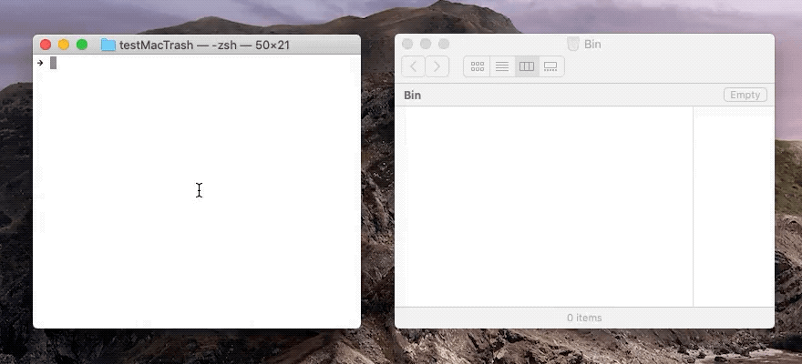

[](https://github.com/johansatge/mac-trash/releases)
[](https://www.pkgstats.com/pkg:mac-trash)
[](https://github.com/johansatge/mac-trash/commits/master)
[](https://travis-ci.com/johansatge/mac-trash)
[](https://codecov.io/github/johansatge/mac-trash/)
[](https://packagephobia.com/result?p=mac-trash)

> Zero-dependency macOS CLI tool to move files to the Trash

---

* [Demo](#demo)
* [Installation](#installation)
* [Usage](#usage)
  * [Options](#options)
* [Changelog](#changelog)
* [License](#license)

## Demo



## Installation

_This module needs Node `>=12`._

Install with [npm](https://www.npmjs.com/):

```bash
$ npm install mac-trash --global --production
```

## Usage

```bash
$ trash somefile.txt /some/other/file.txt
```

### Options

Show debug information:

```bash
$ trash --verbose /some/file.txt
```

Show contextual help:

```bash
$ trash --help
```

Show version:

```bash
$ trash --version
```

## Changelog

This project uses [semver](http://semver.org/).

| Version | Date | Notes |
| --- | --- | --- |
| `2.0.0` | 2022-01-08 | Rework deletion method, update deps, update Node support (#1) |
| `1.0.1` | 2020-11-15 | Fix CLI initialization |
| `1.0.0` | 2020-11-15 | Initial version |

## License

This project is released under the [MIT License](license.md).
